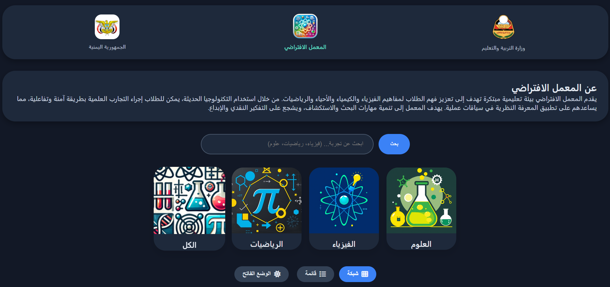
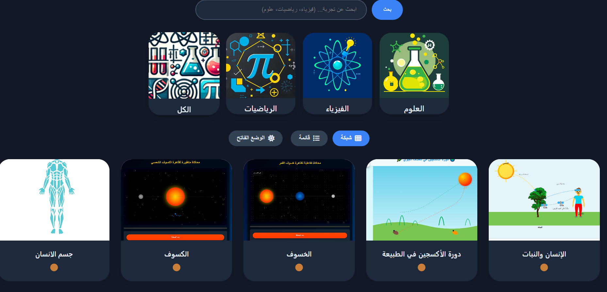
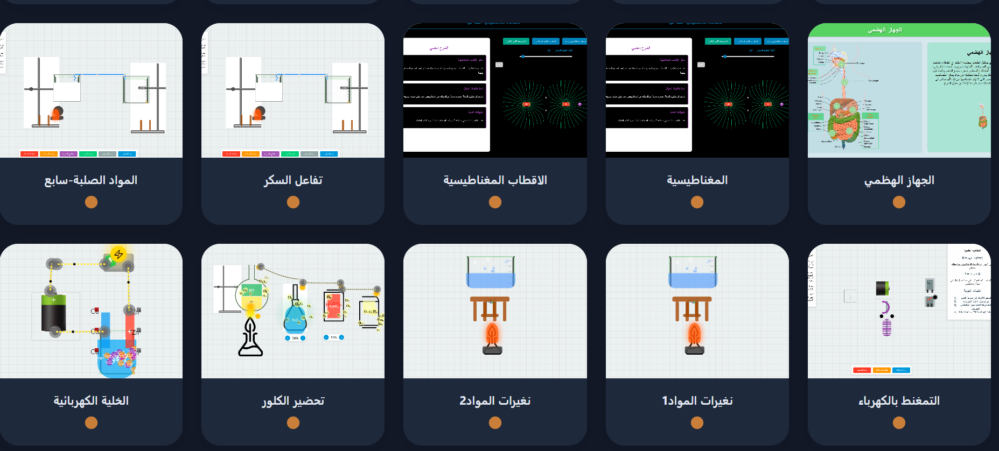
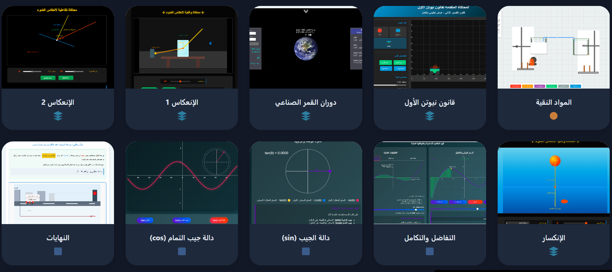

# School Lab

<p align="center">
  <a href="https://syfd74582.github.io/School-lab/">
    
  </a>
</p>

<p align="center">
  
  
  
  
</p>

---

## 📖 About the Project

<p align="center">
  <a href="https://syfd74582.github.io/School-lab/">
    
  </a>
</p>

##

<p align="center">
  <a href="https://syfd74582.github.io/School-lab/">
    
  </a>
</p>

##

<p align="center">
  <a href="https://syfd74582.github.io/School-lab/">
    
  </a>
</p>

**Virtual Lab** is a website designed to facilitate interactive education by providing a collection of scientific and mathematical experiments in a simulation environment. Students and teachers can explore concepts visually and interactively without the need for physical lab equipment.

The website includes:
- Experiment categories: **Sciences**, **Physics**, **Mathematics**, and **All**.
- A search bar for quick access to experiments.
- The ability to toggle between **Grid** and **List** views.
- **Dark Mode** with saved preferences.
- A responsive design that mimics the desktop experience on mobile devices (with horizontal scrolling).

---

## ✨ Features

- **Fully Arabic user interface** (right-to-left layout).
- **All experiments displayed** by default on page load.
- **Filter by subject** via category buttons (thumbnail image + title).
- **Instant search** – highlights results and scrolls to them.
- **User preferences saved** (dark mode, grid/list view) using Local Storage.
- **Stable links** – folders and files renamed to English to ensure compatibility with GitHub Pages.
- **Separate experiment pages** that can be updated later with real content.

---

## 🚀 How to Use

1. **Clone the repository**  
   ```bash
   git clone https://github.com/syfd74582/School-lab.git
   ```
2. **Update links**  
   Inside `index.html`, make sure the experiment paths (`href`) point to the actual files on your device or GitHub.
3. **Upload files to GitHub**  
   Ensure all experiment folders and their images are uploaded.
4. **Enable GitHub Pages**  
   Go to `Settings > Pages` and select the main branch as the source. The site will be published at a URL like `https://your-username.github.io/repo-name/`.

---

## 📁 Project Structure

```
School-lab/
├── index.html                     # Main page
├── images/                        # Logos and backgrounds
│   ├── picher/
│   │   ├── logo.png
│   │   ├── Chemistry.png
│   │   ├── Physical.png
│   │   └── Math.png
│   ├── cu_logo.ico
│   └── bb.png
├── newton-first-law/              # Physics experiments
│   ├── niotan1_all.html
│   └── niotan-1.png
├── reflection-1/                  # Reflection experiment
├── math/                          # Mathematics experiments
│   ├── tafatol/
│   ├── sinn/
│   └── ...
├── human-plant/                   # Science experiments
├── oxygen-cycle/
└── ...                            # Remaining folders
```

**Note:** Folder and file names have been converted to English to ensure compatibility with GitHub Pages.

---

## 🛠 Technologies Used

- **HTML5** – Page structure.
- **CSS3** – Styling, variables, dark mode, flexbox/grid.
- **JavaScript (ES6)** – Filtering, search, view toggling, preference saving.
- **Font Awesome** – Additional icons.

---

## 📝 How to Add New Experiments

1. Create a new folder for the experiment in the appropriate category (e.g., `physics/`, `math/`, or `science/`).
2. Place the experiment's `index.html` file inside the folder along with required images.
3. Open the main `index.html` and add a new `<li>` element in the appropriate section (Physics, Mathematics, or Sciences) with the updated `href` and image path.
4. Re-upload the files to GitHub.

**Example for adding a new physics experiment:**
```html
<li>
  <a class="tile" href="./new-experiment/index.html">
    <div class="image-holder"></div>
    <div class="information">
      <div class="title-holder"><span class="title">Experiment Name</span></div>
      <div class="icons">...</div>
    </div>
  </a>
</li>
```

---

## 🌐 Live Demo

You can view the live site at the following link (after enabling GitHub Pages):  
[https://syfd74582.github.io/School-lab/](https://syfd74582.github.io/School-lab/)

---

## 🤝 Contributing

Contributions are welcome! If you'd like to add new experiments or improve the design:
1. Fork the project.
2. Create a new branch (`git checkout -b feature/amazing-feature`).
3. Make your changes.
4. Commit your changes (`git commit -m 'Add some amazing feature'`).
5. Push to the branch (`git push origin feature/amazing-feature`).
6. Open a Pull Request.

---

## 📄 License

This project is licensed under the **MIT** License – feel free to use and modify it freely for educational and non-commercial purposes.

---

## 📧 Contact

For inquiries or support:
- Email: alqyadydnan@gmail.com
- Or via GitHub Issues.

---
